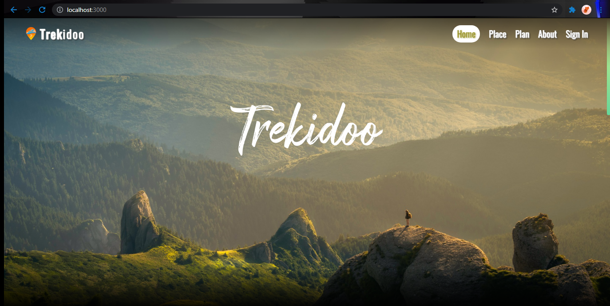

# TREKIDOO
Welcome to Trekidoo repository. Created by Legal Pirates

Download and open the project in any of your favourite editor.

# Requirements

1. Node
2. Mongodb should be installed in your machine 
 

# Installing pakages

Run npm i command in the terminal to install all the necessary packages.

After installing all the packages run nodemon server in the terminal to start the node server. 

Type http://localhost:3000/ in your search bar to run the website. 
